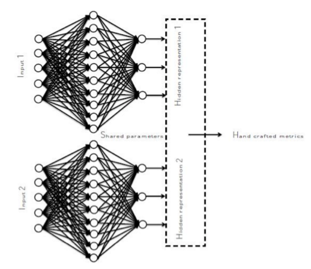

# Introduction

The code is for implementation of the Siamese architecture using Tensorflow. The input data type is HDF5. This implementation contains two identical MLP(multi layer perceptron) followed by a contrastive loss cost function. The system platform has to be chosen as the following image: . 

The Siamese architecture is used for training a similarity metric from data. The method is used for recognition or verification applications where the number of classes is very large and not known during training, and where the number of
training samples for a single class is very small and the class is not important. The idea is to learn a function that maps input patterns into a target space with the impostor pairs(pairs which do not belong to the same class) become as separated as possible and genuine pairs(pairs which belong to the same class) become as close as possible using the simple distance metrics.


# Example

The code implementation must separate the the data in the output space. Since for this open source project the application of Siamese Architecture is face verification, ROC curve can be good representative of the results. Moreover since the separation in output domain is crucial, the histogram representation of the data at input and output is of great interest.
The examples are present in **Sample-Results** folder.

# Motivation

The reason behind Tensorflow implementation of Siamese Archiecture with MLP is that other implementations like the ones in Caffe does not have too much flexibility and its due to the nature of Caffe. Moreover to the best of our knowldege, there was not any other implemetation on the web to be able to do the tasks related to our under_study application.

# Implementation

The implementation part divided to some parts. Data calling and output demonstration.

## Data Input

The data input type is HDF5. HDF5 is easy to handle and there are lots of documentation about that on the web.
It can be read by using the simple code below:
```
TRAIN_FILE = h5py.File('TRAIN.hdf5', 'r')
TEST_FILE = h5py.File('TEST.hdf5', 'r')
X_train = TRAIN_FILE['pairs']
y_train = TRAIN_FILE['labels']
X_test = TEST_FILE['pairs']
y_test = TEST_FILE['labels']
```

The labels and pairs itself(recall that the application is face verification) should be saved with different names for convenient.

## Plotting Results

Two kind of curves are considered for plotting. ROC curve and Precision-Recall curve. The second one is more precise specifically if there is a huge difference between the number of genuine and impostor pairs. Moreover the histogram of the input and output should be demonstrated as well to reflect the discriminative ability of the structure. For the training phase the output can be depicted by the following code.

```
# Plot ROC for training
Plot_ROC_Fn(label_train, distance_original_train, 'Train', 'Input')
Plot_ROC_Fn(label_train, distance_train, 'Train', 'Output')

# Plot PR for training
Plot_PR_Fn(label_train, distance_original_train , 'Train', 'Input')
Plot_PR_Fn(label_train, distance_train, 'Train', 'Output')


# Plot HIST for training
Plot_HIST_Fn(label_train, distance_original_train, 'Train', 'Input')
Plot_HIST_Fn(label_train, distance_train, 'Train', 'Output')
```


